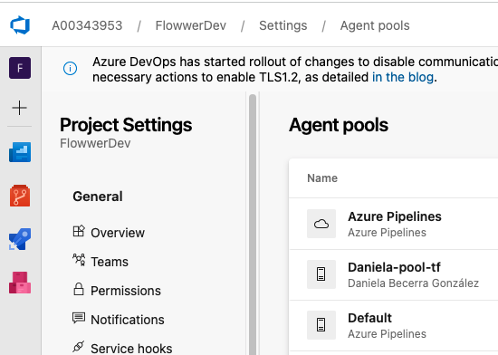

# azure-devops-with-terraform

Configure Azure Devops resources with terraform

This terraform configuration files will create
- a project inside your organization called `FlowwerDev`
- an agent pool called `Daniela-pool-tf`

